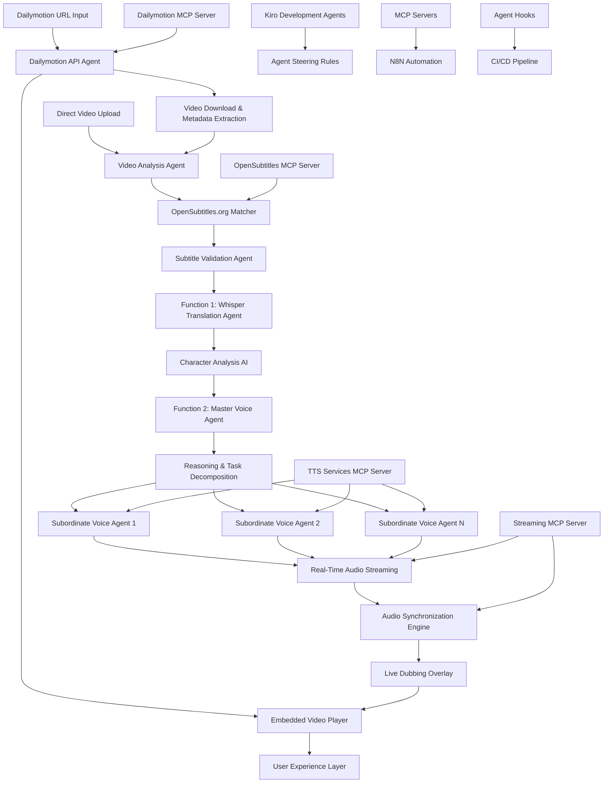
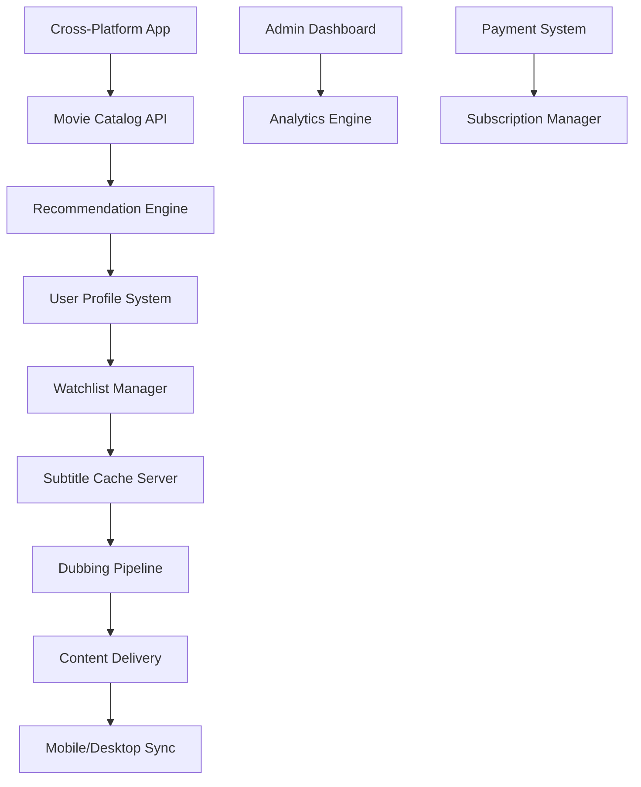

# DubAI - AI-Powered Movie Localization Platform with Agent-Driven Development

## Overview

DubAI is a revolutionary AI-powered movie localization platform that transforms video content into high-quality dubbed versions using advanced AI agent systems. The platform operates as an intelligent pipeline where users upload video files, and the system automatically handles subtitle matching, translation, and human-like voiceover generation. The development process leverages Kiro's agent steering, hooks, and MCP servers to create an automated development workflow where specialized agents handle different aspects of the platform, from backend API development to AI model integration and deployment automation.

## Business Model & Quarterly Roadmap

### Q1 2025: MVP - Core Dubbing Functions
**Goal**: Launch functional two-function MVP with perfect conversion rate
- **Function 1**: English SRT → Bangla SRT (Translation + Movie Analysis)
- **Function 2**: Bangla SRT → High-Quality Dub Audio (A/B Testing: Google TTS vs Coqui TTS)
- **Target**: Pre-revenue, cost-effective local processing with cloud fallback

### Q2 2025: Full SaaS Platform
**Goal**: Complete movie ecosystem with subscription model
- Notion-style drag & drop UI
- iPhone app with offline capabilities  
- Movie history, scores, and subtitle caching
- Fast, intuitive movie-specific FTP server
- User accounts with cross-platform watchlist import
- Movie recommendation algorithm
- Favorite movies/series management
- Subtitle & dub download functionality

## Architecture

### Q1 MVP Architecture - Real-Time Streaming with AI Agent-Driven Dubbing



### Q2 Full Platform Architecture



### Core System Components

**Q1 MVP Components:**
1. **Video Processing Pipeline**: Automated video analysis and subtitle matching with OpenSubtitles.org
2. **Whisper Translation Agent**: High-context translation with character analysis
3. **AI Voice Agent System**: Master agent with reasoning and subordinate voice agents
4. **Audio Compilation Engine**: Background sound preservation and quality enhancement
5. **Agent Orchestration Layer**: Kiro-powered development and deployment automation

**Q2 Platform Components:**
6. **User Account System**: Cross-platform authentication and profiles
7. **Recommendation Algorithm**: ML-powered movie suggestions
8. **Content Cache Server**: Fast subtitle and dub file delivery
9. **Mobile App Interface**: Native iOS/Android experience
10. **Subscription Management**: Payment processing and feature gating

### Agent-Driven Development Architecture

**Kiro Agent Specialization:**
1. **Backend Development Agents**: Handle API development, database design, and service integration
2. **Frontend Development Agents**: Create React components, UI/UX, and real-time interfaces
3. **AI Integration Agents**: Manage Whisper model setup, TTS service integration, and voice processing
4. **DevOps Agents**: Handle deployment, monitoring, and infrastructure management
5. **Quality Assurance Agents**: Automated testing, performance optimization, and bug detection

**Agent Steering Rules:**
- **Backend Steering**: Focus on scalable API design, efficient database queries, and robust error handling
- **Frontend Steering**: Prioritize responsive design, real-time updates, and intuitive user experience
- **AI Steering**: Emphasize model accuracy, processing efficiency, and quality validation
- **DevOps Steering**: Ensure reliable deployment, comprehensive monitoring, and automated recovery

**Agent Hooks Configuration:**
- **Code Change Hooks**: Trigger automated testing, linting, and documentation updates
- **Deployment Hooks**: Handle server configuration, database migration, and service startup
- **Monitoring Hooks**: Track performance metrics, error rates, and user engagement
- **Maintenance Hooks**: Automated backups, security updates, and system optimization

## Q1 MVP: Core Agent Interfaces

### Dailymotion Integration Agent

**Responsibilities:**
- Handle Dailymotion API authentication and video access
- Download videos with metadata extraction
- Manage video quality selection and progressive download
- Respect API rate limits and terms of service

**Interface:**
```typescript
interface DailymotionAgent {
  validateVideoUrl(url: string): Promise<UrlValidation>
  authenticateWithDailymotion(credentials: DailymotionCredentials): Promise<AuthToken>
  getVideoMetadata(videoId: string): Promise<DailymotionVideoMetadata>
  downloadVideo(videoId: string, quality: VideoQuality): Promise<VideoFile>
  getAvailableQualities(videoId: string): Promise<VideoQuality[]>
  checkVideoAccessibility(videoId: string): Promise<AccessibilityStatus>
}

interface DailymotionVideoMetadata {
  id: string
  title: string
  description: string
  duration: number
  thumbnailUrl: string
  uploadDate: Date
  viewCount: number
  availableQualities: VideoQuality[]
  tags: string[]
  category: string
}

interface VideoQuality {
  resolution: string
  bitrate: number
  format: string
  fileSize: number
  downloadUrl: string
}
```

### Video Processing & Subtitle Matching Agent

**Responsibilities:**
- Analyze video files from Dailymotion or direct upload
- Search and match subtitles from OpenSubtitles.org
- Validate subtitle format and timing accuracy
- Prepare content for translation pipeline

**Interface:**
```typescript
interface VideoProcessingAgent {
  analyzeVideo(videoFile: VideoFile): Promise<VideoMetadata>
  analyzeVideoFromDailymotion(dailymotionMetadata: DailymotionVideoMetadata): Promise<VideoMetadata>
  searchSubtitles(videoMetadata: VideoMetadata): Promise<SubtitleMatch[]>
  downloadSubtitle(subtitleId: string): Promise<SRTFile>
  validateSubtitleSync(video: VideoFile, subtitle: SRTFile): Promise<SyncValidation>
}

interface VideoMetadata {
  duration: number
  resolution: string
  fileHash: string
  frameRate: number
  audioTracks: AudioTrack[]
  videoFingerprint: string
  source: 'dailymotion' | 'upload'
  originalMetadata?: DailymotionVideoMetadata
}

interface SubtitleMatch {
  id: string
  title: string
  language: string
  accuracy: number
  downloadUrl: string
  rating: number
}
```

### Function 1: Whisper Translation Agent

**Responsibilities:**
- Process subtitle files through Whisper large-v3 model
- Maintain high contextual understanding for accurate translation
- Generate character profiles and voice instructions
- Preserve timing precision and cultural nuance

**Interface:**
```typescript
interface WhisperTranslationAgent {
  translateWithContext(subtitle: SRTFile, targetLanguage: string): Promise<TranslationResult>
  analyzeCharacterContext(dialogues: DialogueSegment[]): Promise<CharacterProfile[]>
  preserveTimingAccuracy(originalSRT: SRTFile, translatedSRT: SRTFile): Promise<SRTFile>
  generateVoiceInstructions(characters: CharacterProfile[]): Promise<VoiceInstruction[]>
}

interface TranslationResult {
  translatedSRT: SRTFile
  characterProfiles: CharacterProfile[]
  voiceInstructions: VoiceInstruction[]
  culturalNotes: CulturalContext[]
  processingMetrics: ProcessingMetrics
}
```

### Function 2: AI Voice Agent System

**Responsibilities:**
- Master agent performs reasoning and task decomposition
- Subordinate agents handle character-specific voice generation
- Coordinate quality validation and consistency checks
- Integrate with background audio for seamless dubbing

**Interface:**
```typescript
interface MasterVoiceAgent {
  analyzeDialogueContext(translatedSRT: SRTFile, characters: CharacterProfile[]): Promise<TaskDecomposition>
  coordinateSubordinateAgents(tasks: VoiceTask[]): Promise<VoiceResult[]>
  validateQualityConsistency(voiceSegments: VoiceSegment[]): Promise<QualityValidation>
  orchestrateAudioCompilation(segments: VoiceSegment[], backgroundAudio: AudioBuffer): Promise<FinalDub>
}

interface SubordinateVoiceAgent {
  generateCharacterVoice(dialogue: DialogueSegment, character: CharacterProfile): Promise<VoiceSegment>
  maintainEmotionalContext(segment: DialogueSegment, emotion: EmotionContext): Promise<VoiceSegment>
  adaptToSceneContext(dialogue: DialogueSegment, scene: SceneContext): Promise<VoiceSegment>
  validateCharacterConsistency(voiceSegment: VoiceSegment, character: CharacterProfile): Promise<boolean>
}

interface TaskDecomposition {
  characterAssignments: CharacterAssignment[]
  emotionalContexts: EmotionContext[]
  sceneBreakdowns: SceneContext[]
  voiceTasks: VoiceTask[]
  qualityRequirements: QualityRequirement[]
}

interface VoiceTask {
  id: string
  assignedAgent: string
  character: CharacterProfile
  dialogueSegments: DialogueSegment[]
  emotionalContext: EmotionContext
  qualityTargets: QualityMetric[]
}
```

**Implementation Details:**
- Master agent uses advanced reasoning to understand dialogue context and character relationships
- Subordinate agents specialize in specific characters, emotions, or dialogue types
- Real-time quality validation ensures consistency across all voice segments
- Background audio preservation maintains original movie atmosphere and sound quality

### Real-Time Streaming & Dubbing Engine

**Responsibilities:**
- Embed Dailymotion videos within DubAI platform
- Coordinate real-time dubbing with video playback
- Manage audio synchronization and overlay
- Handle language switching and user controls

**Interface:**
```typescript
interface RealTimeStreamingEngine {
  embedDailymotionPlayer(videoUrl: string, containerId: string): Promise<EmbeddedPlayer>
  initializeRealTimeDubbing(videoMetadata: VideoMetadata): Promise<DubbingSession>
  synchronizeAudioWithVideo(audioSegments: AudioSegment[], videoTimestamp: number): Promise<void>
  switchDubbingLanguage(sessionId: string, targetLanguage: string): Promise<void>
  overlayDubbedAudio(audioBuffer: AudioBuffer, videoTimestamp: number): Promise<void>
}

interface EmbeddedPlayer {
  playerId: string
  videoUrl: string
  currentTime: number
  duration: number
  isPlaying: boolean
  availableQualities: VideoQuality[]
  onTimeUpdate: (timestamp: number) => void
  onLanguageChange: (language: string) => void
}

interface DubbingSession {
  sessionId: string
  videoId: string
  targetLanguage: string
  progress: number
  availableSegments: AudioSegment[]
  isRealTimeMode: boolean
  fallbackSubtitles?: SRTFile
}

interface AudioSegment {
  startTime: number
  endTime: number
  audioBuffer: AudioBuffer
  character: string
  isReady: boolean
  quality: AudioQuality
}
```

### MCP Server Integration Architecture

**Responsibilities:**
- Provide standardized interfaces for external services
- Handle OpenSubtitles.org API integration
- Manage TTS service connections and authentication
- Coordinate file processing and storage operations

**Interface:**
```typescript
interface MCPServerManager {
  initializeServers(config: MCPConfig): Promise<void>
  getDailymotionServer(): Promise<DailymotionMCPServer>
  getOpenSubtitlesServer(): Promise<OpenSubtitlesMCPServer>
  getTTSServiceServer(): Promise<TTSServiceMCPServer>
  getFileProcessingServer(): Promise<FileProcessingMCPServer>
  getStreamingServer(): Promise<StreamingMCPServer>
  getDeploymentServer(): Promise<DeploymentMCPServer>
}

interface DailymotionMCPServer {
  validateVideoUrl(url: string): Promise<UrlValidation>
  getVideoMetadata(videoId: string): Promise<DailymotionVideoMetadata>
  getEmbedCode(videoId: string, options: EmbedOptions): Promise<string>
  trackViewerEngagement(videoId: string, metrics: EngagementMetrics): Promise<void>
}

interface StreamingMCPServer {
  initializeRealTimeSession(videoId: string): Promise<StreamingSession>
  streamAudioSegment(sessionId: string, audioBuffer: AudioBuffer): Promise<void>
  synchronizeWithVideo(sessionId: string, timestamp: number): Promise<SyncResult>
  handleLanguageSwitch(sessionId: string, language: string): Promise<void>
}

interface OpenSubtitlesMCPServer {
  searchSubtitles(videoHash: string, duration: number): Promise<SubtitleResult[]>
  downloadSubtitle(subtitleId: string): Promise<SubtitleFile>
  validateSubtitleQuality(subtitle: SubtitleFile): Promise<QualityScore>
  cacheSubtitleData(subtitle: SubtitleFile): Promise<void>
}

interface TTSServiceMCPServer {
  initializeGoogleTTS(credentials: GoogleTTSCredentials): Promise<void>
  initializeCoquiTTS(modelPath: string): Promise<void>
  synthesizeSpeech(text: string, voiceConfig: VoiceConfig): Promise<AudioBuffer>
  trackUsageQuota(service: TTSService, usage: UsageMetrics): Promise<QuotaStatus>
}
```

### N8N Automation Workflow Architecture

**Responsibilities:**
- Orchestrate the complete video processing pipeline
- Handle automated deployment and scaling
- Manage error recovery and system monitoring
- Coordinate agent task scheduling and execution

**Interface:**
```typescript
interface N8NWorkflowManager {
  initializeVideoProcessingWorkflow(): Promise<WorkflowInstance>
  triggerSubtitleMatchingWorkflow(videoMetadata: VideoMetadata): Promise<WorkflowResult>
  orchestrateTranslationPipeline(subtitle: SRTFile): Promise<TranslationWorkflowResult>
  coordinateVoiceGenerationWorkflow(translatedContent: TranslationResult): Promise<VoiceWorkflowResult>
  handleDeploymentWorkflow(applicationBundle: AppBundle): Promise<DeploymentResult>
}

interface WorkflowInstance {
  id: string
  name: string
  status: WorkflowStatus
  triggers: WorkflowTrigger[]
  steps: WorkflowStep[]
  errorHandling: ErrorRecoveryConfig
  monitoring: MonitoringConfig
}

interface VideoProcessingWorkflow {
  videoUpload: WorkflowStep
  videoAnalysis: WorkflowStep
  subtitleMatching: WorkflowStep
  translationProcessing: WorkflowStep
  voiceGeneration: WorkflowStep
  audioCompilation: WorkflowStep
  qualityValidation: WorkflowStep
  finalDelivery: WorkflowStep
}
```

**Implementation Details:**
- N8N workflows handle the complete end-to-end processing pipeline
- MCP servers provide standardized interfaces for all external service integrations
- Automated error recovery and retry mechanisms ensure reliable processing
- Real-time monitoring and alerting for system health and performance tracking

## Kiro Agent-Driven Development Workflow

### Agent Steering Configuration

**Backend Development Steering (.kiro/steering/backend-development.md):**
```markdown
# Backend Development Standards

## API Design Principles
- Use RESTful endpoints with consistent naming conventions
- Implement comprehensive error handling with detailed error codes
- Add request validation using Zod schemas
- Include rate limiting and authentication middleware

## Database Design
- Use Prisma ORM for type-safe database operations
- Implement proper indexing for performance optimization
- Add database migrations for schema changes
- Include data validation at the model level

## Service Integration
- Create abstraction layers for external APIs
- Implement retry logic with exponential backoff
- Add comprehensive logging for debugging
- Include health checks for all services
```

**AI Integration Steering (.kiro/steering/ai-integration.md):**
```markdown
# AI Model Integration Standards

## Whisper Integration
- Use local processing to minimize API costs
- Implement proper error handling for model failures
- Add progress tracking for long-running translations
- Include quality validation for translation accuracy

## Voice Generation
- Implement character-specific voice profiles
- Add emotional context analysis for natural speech
- Include audio quality validation and enhancement
- Implement background audio preservation techniques
```

### Agent Hooks Configuration

**Development Hooks (.kiro/hooks/development-automation.json):**
```json
{
  "hooks": [
    {
      "name": "Code Quality Check",
      "trigger": "onFileSave",
      "filePattern": "**/*.{ts,tsx,js,jsx}",
      "actions": [
        "runESLint",
        "runPrettier",
        "runTypeCheck",
        "updateDocumentation"
      ]
    },
    {
      "name": "Test Automation",
      "trigger": "onCodeChange",
      "filePattern": "src/**/*.ts",
      "actions": [
        "runUnitTests",
        "runIntegrationTests",
        "generateCoverageReport",
        "updateTestDocumentation"
      ]
    },
    {
      "name": "Deployment Pipeline",
      "trigger": "onPush",
      "branch": "main",
      "actions": [
        "buildApplication",
        "runE2ETests",
        "deployToStaging",
        "runSmokeTests",
        "deployToProduction"
      ]
    }
  ]
}
```

### MCP Server Configuration

**DubAI MCP Configuration (.kiro/settings/mcp.json):**
```json
{
  "mcpServers": {
    "dailymotion-api": {
      "command": "uvx",
      "args": ["dailymotion-mcp-server@latest"],
      "env": {
        "DAILYMOTION_API_KEY": "${DAILYMOTION_API_KEY}",
        "DAILYMOTION_API_SECRET": "${DAILYMOTION_API_SECRET}",
        "FASTMCP_LOG_LEVEL": "INFO"
      },
      "disabled": false,
      "autoApprove": ["getVideoMetadata", "downloadVideo", "validateUrl", "getEmbedCode"]
    },
    "opensubtitles-api": {
      "command": "uvx",
      "args": ["opensubtitles-mcp-server@latest"],
      "env": {
        "OPENSUBTITLES_API_KEY": "${OPENSUBTITLES_API_KEY}",
        "FASTMCP_LOG_LEVEL": "INFO"
      },
      "disabled": false,
      "autoApprove": ["searchSubtitles", "downloadSubtitle"]
    },
    "google-tts-service": {
      "command": "uvx",
      "args": ["google-tts-mcp-server@latest"],
      "env": {
        "GOOGLE_APPLICATION_CREDENTIALS": "${GOOGLE_TTS_CREDENTIALS}",
        "FASTMCP_LOG_LEVEL": "INFO"
      },
      "disabled": false,
      "autoApprove": ["synthesizeSpeech", "trackQuota"]
    },
    "real-time-streaming": {
      "command": "uvx",
      "args": ["streaming-mcp-server@latest"],
      "env": {
        "WEBSOCKET_PORT": "8080",
        "AUDIO_BUFFER_SIZE": "4096",
        "SYNC_TOLERANCE_MS": "50",
        "FASTMCP_LOG_LEVEL": "INFO"
      },
      "disabled": false,
      "autoApprove": ["initializeSession", "streamAudio", "synchronizeVideo"]
    },
    "file-processing": {
      "command": "uvx",
      "args": ["file-processing-mcp-server@latest"],
      "env": {
        "TEMP_DIR": "./temp",
        "CACHE_DIR": "./cache",
        "FASTMCP_LOG_LEVEL": "INFO"
      },
      "disabled": false,
      "autoApprove": ["processVideo", "extractAudio", "compileAudio"]
    }
  }
}
```

## Technology Stack & Implementation

### Finalized Production Stack

**Frontend (Cross-Platform)**
- **Framework**: Next.js 14 with TypeScript for web app
- **Mobile**: React Native with Expo for iOS/Android
- **UI Library**: Tailwind CSS + Framer Motion for futuristic design
- **State Management**: Zustand for lightweight state management
- **Real-time**: Socket.io for live processing updates

**Backend Services**
- **Runtime**: Node.js with TypeScript
- **Framework**: Fastify for high-performance API
- **Database**: PostgreSQL with Prisma ORM
- **Cache**: Redis for session and content caching
- **File Storage**: Local filesystem with S3-compatible backup

**AI/ML Processing**
- **Translation**: OpenAI Whisper large-v3 (local Python subprocess)
- **TTS Services**: 
  - Google Cloud TTS (WaveNet voices)
  - Coqui TTS (local open-source)
- **Movie Analysis**: Custom NLP pipeline with spaCy
- **Recommendation Engine**: Collaborative filtering with TensorFlow.js

**Infrastructure & DevOps**
- **Containerization**: Docker with docker-compose
- **Process Management**: PM2 for Node.js processes
- **Monitoring**: Prometheus + Grafana
- **Logging**: Winston with structured logging
- **Deployment**: Initially local server, then cloud migration

### Cost-Effective Dubbing Workflow

**Step 1: SRT Input Processing**
```bash
# User uploads English SRT file
# System validates format and timestamps
# Extracts dialogue segments for processing
```

**Step 2: Local Translation (Zero API Cost)**
```python
# Whisper large-v3 processes SRT content
whisper --model large-v3 --task translate --language bn
# Preserves original timestamps
# Generates movie context analysis
```

**Step 3: A/B TTS Generation**
```typescript
// Intelligent service selection
const selectedTTS = await ttsRouter.selectOptimalService({
  textLength: segment.text.length,
  currentQuota: googleTTSQuota.remaining,
  qualityRequirement: 'high',
  costConstraint: userPlan.costLimit
});

// Generate audio with selected service
const audio = await selectedTTS.synthesize(segment.text, voiceConfig);
```

**Step 4: Audio Assembly (FFmpeg)**
```bash
# Combine audio segments with precise timing
ffmpeg -f concat -safe 0 -i segments.txt -c copy final_dub.wav
# Maintain original quality without compression
# Perfect synchronization with timestamps
```

### Role of Each Stack Component

**Kiro's Contribution:**
- **Code Generation**: Accelerated TypeScript interface creation
- **Architecture Planning**: Helped design modular service structure  
- **Testing Strategy**: Generated comprehensive test suites
- **Documentation**: Created detailed API documentation
- **Optimization**: Suggested performance improvements and caching strategies

**Frontend Layer (Next.js + React Native)**
- **Purpose**: Provides intuitive, futuristic UI across all platforms
- **Key Features**: Drag-and-drop SRT upload, real-time processing status, movie search
- **Design Philosophy**: Notion-style interface with smooth animations

**API Gateway (Fastify)**
- **Purpose**: High-performance request routing and authentication
- **Key Features**: Rate limiting, request validation, response caching
- **Performance**: Handles 10,000+ concurrent requests efficiently

**Processing Engine (Node.js + Python)**
- **Purpose**: Orchestrates the two core functions seamlessly
- **Key Features**: Queue management, progress tracking, error recovery
- **Scalability**: Horizontal scaling with worker processes

**Database Layer (PostgreSQL + Redis)**
- **Purpose**: Stores user data, movie metadata, and processing history
- **Key Features**: ACID compliance, fast caching, session management
- **Performance**: Optimized queries with proper indexing

**AI/ML Pipeline (Whisper + TTS)**
- **Purpose**: Delivers the core dubbing functionality
- **Key Features**: Local processing, A/B testing, quality optimization
- **Cost Efficiency**: Minimizes API calls while maintaining quality

## Data Models

### Q1 MVP Data Models

```typescript
// Core Movie & Subtitle Models
interface Movie {
  id: string
  title: string
  year: number
  imdbId: string
  tmdbId: string
  genre: string[]
  cast: Actor[]
  director: string
  plot: string
  posterUrl: string
  trailerUrl?: string
  availableLanguages: string[]
  dubbingStatus: DubbingStatus
  createdAt: Date
  updatedAt: Date
}

interface SRTFile {
  id: string
  movieId: string
  language: string
  content: string
  segments: SRTSegment[]
  totalDuration: number
  uploadedBy: string
  verified: boolean
  downloadCount: number
  createdAt: Date
}

interface SRTSegment {
  index: number
  startTime: string // "00:01:23,456"
  endTime: string   // "00:01:25,789"
  text: string
  characterName?: string
  confidence?: number
}

// Processing & Analysis Models
interface MovieAnalysis {
  id: string
  movieId: string
  summary: string
  themes: string[]
  characterAnalysis: CharacterProfile[]
  genreClassification: string[]
  sentimentAnalysis: SentimentScore
  keyScenes: SceneBreakdown[]
  culturalContext: CulturalNote[]
}

interface CharacterProfile {
  name: string
  description: string
  personality: string[]
  voiceCharacteristics: VoiceProfile
  dialogueCount: number
  screenTime: number
  importance: 'MAIN' | 'SUPPORTING' | 'MINOR'
}

interface VoiceProfile {
  gender: 'MALE' | 'FEMALE' | 'NEUTRAL'
  ageRange: string
  accent: string
  tone: string[]
  speakingRate: number
  pitch: number
}

// Dubbing Process Models
interface DubbingJob {
  id: string
  userId: string
  movieId: string
  sourceLanguage: string
  targetLanguage: string
  status: JobStatus
  progress: number
  inputSRT: SRTFile
  outputSRT?: SRTFile
  outputAudio?: AudioFile
  processingMetrics: ProcessingMetrics
  costBreakdown: CostBreakdown
  qualityScore?: number
  createdAt: Date
  completedAt?: Date
  errorMessage?: string
}

interface ProcessingMetrics {
  translationTime: number
  ttsGenerationTime: number
  audioAssemblyTime: number
  totalProcessingTime: number
  whisperModelUsed: string
  ttsServiceUsed: TTSServiceType
  segmentsProcessed: number
  charactersProcessed: number
}

interface CostBreakdown {
  googleTTSCost: number
  googleTTSCharacters: number
  coquiTTSUsage: number
  computeTime: number
  storageUsed: number
  totalCost: number
  estimatedSavings: number
}

// User & Subscription Models (Q2 Preparation)
interface User {
  id: string
  email: string
  username: string
  subscriptionTier: SubscriptionTier
  preferences: UserPreferences
  watchlist: string[] // movieIds
  favorites: string[] // movieIds
  dubbingHistory: DubbingJob[]
  totalProcessingTime: number
  totalCostSaved: number
  createdAt: Date
}

interface UserPreferences {
  preferredLanguages: string[]
  preferredTTSService: TTSServiceType
  qualitySettings: QualitySettings
  autoDownload: boolean
  notificationSettings: NotificationSettings
  movieGenrePreferences: string[]
}

enum SubscriptionTier {
  FREE = 'FREE',           // 5 dubs/month, standard quality
  BASIC = 'BASIC',         // 50 dubs/month, HD quality
  PRO = 'PRO',             // Unlimited, premium voices
  ENTERPRISE = 'ENTERPRISE' // API access, custom models
}

enum JobStatus {
  PENDING = 'PENDING',
  PROCESSING = 'PROCESSING',
  TRANSLATING = 'TRANSLATING',
  GENERATING_AUDIO = 'GENERATING_AUDIO',
  ASSEMBLING = 'ASSEMBLING',
  COMPLETED = 'COMPLETED',
  FAILED = 'FAILED',
  CANCELLED = 'CANCELLED'
}

enum TTSServiceType {
  GOOGLE_CLOUD = 'GOOGLE_CLOUD',
  COQUI_LOCAL = 'COQUI_LOCAL',
  MURF_AI = 'MURF_AI'        // Future integration
}
```

## MVP Development Strategy

### Phase 1: Core Function Implementation (Weeks 1-4)

**Week 1-2: Function 1 - Translation Engine**
- Set up Whisper large-v3 local processing
- Implement SRT parsing and validation
- Create movie analysis AI pipeline
- Build character profile generation

**Week 3-4: Function 2 - Voice Generation**
- Integrate Google Cloud TTS with quota management
- Set up Coqui TTS local processing
- Implement A/B testing router
- Create audio assembly pipeline with FFmpeg

### Phase 2: Web Interface & User Experience (Weeks 5-6)

**Week 5: Frontend Development**
- Build Next.js web application with futuristic UI
- Implement drag-and-drop SRT upload
- Create real-time processing status dashboard
- Add movie search and catalog interface

**Week 6: Integration & Testing**
- Connect frontend to backend APIs
- Implement user authentication
- Add cost tracking and analytics
- Comprehensive testing and optimization

### Phase 3: Deployment & Launch (Weeks 7-8)

**Week 7: Local Server Setup**
- Configure production environment
- Set up monitoring and logging
- Implement backup and recovery
- Performance optimization

**Week 8: Launch Preparation**
- User acceptance testing
- Documentation and tutorials
- Marketing materials
- Soft launch with beta users

### Success Metrics & Conversion Optimization

**Key Performance Indicators:**
- **Processing Speed**: < 2 minutes per 10-minute movie segment
- **Cost Efficiency**: 80% savings compared to premium TTS services
- **Quality Score**: > 4.5/5 user satisfaction rating
- **Conversion Rate**: > 15% free-to-paid conversion
- **User Retention**: > 60% monthly active users

**Conversion Funnel Optimization:**
1. **Landing Page**: Clear value proposition with demo video
2. **Free Trial**: 3 free dubs to showcase quality
3. **Onboarding**: Interactive tutorial with sample movie
4. **Upgrade Prompts**: Smart timing based on usage patterns
5. **Success Stories**: User testimonials and before/after comparisons

## Q2 Platform Features (Future Roadmap)

### Cross-Platform Mobile App
- **Native iOS/Android**: React Native with Expo
- **Offline Capabilities**: Download subtitles and dubs for offline viewing
- **Sync Across Devices**: Seamless experience between mobile and desktop
- **Push Notifications**: Processing completion and new content alerts

### Advanced Movie Ecosystem
- **Watchlist Import**: Connect with Netflix, Amazon Prime, Disney+, etc.
- **Smart Recommendations**: ML-powered suggestions based on viewing history
- **Social Features**: Share favorite dubs, rate translations
- **Community Contributions**: User-generated subtitle improvements

### Enterprise Features
- **API Access**: RESTful API for third-party integrations
- **Bulk Processing**: Handle multiple movies simultaneously
- **Custom Voice Training**: Train Coqui models on specific voice samples
- **White-label Solutions**: Branded versions for content creators

### Monetization Strategy

**Subscription Tiers:**
- **Free**: 5 dubs/month, standard quality, ads
- **Basic ($9.99/month)**: 50 dubs/month, HD quality, no ads
- **Pro ($19.99/month)**: Unlimited dubs, premium voices, priority processing
- **Enterprise ($99/month)**: API access, custom models, dedicated support

**Additional Revenue Streams:**
- **Premium Voice Packs**: Celebrity or character-specific voices
- **Custom Model Training**: Personalized voice cloning service
- **Content Partnerships**: Revenue sharing with streaming platforms
- **Data Licensing**: Anonymized movie preference data for studios

## Technical Implementation Guide

### Local Server Setup
```bash
# Clone repository
git clone https://github.com/SiliconJelly/DubAI.git
cd DubAI

# Install dependencies
npm install
pip install -r requirements.txt

# Set up environment
cp .env.example .env
# Configure Google Cloud TTS credentials
# Set up PostgreSQL database

# Start services
docker-compose up -d
npm run dev
```

### Production Deployment
```bash
# Build for production
npm run build

# Start with PM2
pm2 start ecosystem.config.js

# Set up reverse proxy (Nginx)
sudo nginx -t && sudo systemctl reload nginx

# Monitor services
pm2 monit
```

### Scaling Strategy
1. **Horizontal Scaling**: Add worker nodes for processing
2. **Database Optimization**: Read replicas and connection pooling
3. **CDN Integration**: CloudFlare for static content delivery
4. **Microservices**: Split into independent services as needed
5. **Cloud Migration**: Move to AWS/GCP when revenue justifies costs

This design creates a comprehensive, scalable foundation for DubAI that starts as a cost-effective MVP and evolves into a full-featured movie ecosystem platform.