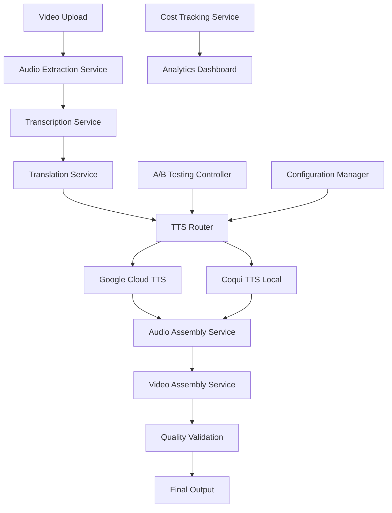

# Design Document

## Overview

The Automated Dubbing Workflow is designed as a modular, cost-optimized micro SaaS platform that transforms English video content into high-quality Bangla dubbed videos. The system architecture prioritizes local processing for cost efficiency while providing cloud-based alternatives for scalability. The design emphasizes modularity, allowing easy integration of new TTS services and languages in the future.

## Architecture

### High-Level Architecture



### System Components

The system follows a microservices architecture with the following core components:

1. **API Gateway**: Handles incoming requests, authentication, and routing
2. **Processing Pipeline**: Orchestrates the entire dubbing workflow
3. **Storage Layer**: Manages temporary and permanent file storage
4. **TTS Service Router**: Manages A/B testing and service selection
5. **Cost Tracking Service**: Monitors usage and costs across services
6. **Quality Assurance Engine**: Validates output quality and synchronization

## Components and Interfaces

### 1. Video Processing Service

**Responsibilities:**
- Extract audio from video files using FFmpeg
- Validate input formats and quality
- Manage temporary file storage

**Interface:**
```typescript
interface VideoProcessingService {
  extractAudio(videoFile: File): Promise<AudioFile>
  validateVideoFormat(videoFile: File): Promise<ValidationResult>
  cleanupTempFiles(sessionId: string): Promise<void>
}
```

**Implementation Details:**
- Uses FFmpeg with optimized parameters for audio extraction
- Supports multiple video formats (MP4, AVI, MOV, MKV)
- Implements file cleanup mechanisms to manage disk space

### 2. Transcription and Translation Service

**Responsibilities:**
- Transcribe English audio using Whisper large-v3
- Translate English text to Bangla
- Generate SRT files with precise timestamps

**Interface:**
```typescript
interface TranscriptionService {
  transcribeAudio(audioFile: AudioFile): Promise<TranscriptionResult>
  translateToTarget(transcription: TranscriptionResult, targetLang: string): Promise<TranslationResult>
  generateSRT(translation: TranslationResult): Promise<SRTFile>
}
```

**Implementation Details:**
- Runs Whisper model locally using Python subprocess
- Implements retry logic for failed transcriptions
- Maintains timestamp precision for perfect synchronization
- Supports batch processing for longer videos

### 3. TTS Service Router

**Responsibilities:**
- Route requests to appropriate TTS service based on A/B testing
- Manage service quotas and fallback mechanisms
- Track performance metrics for each service

**Interface:**
```typescript
interface TTSRouter {
  selectTTSService(request: TTSRequest): Promise<TTSServiceType>
  generateSpeech(text: string, service: TTSServiceType): Promise<AudioSegment>
  trackUsage(service: TTSServiceType, usage: UsageMetrics): Promise<void>
}
```

**Implementation Details:**
- Implements weighted routing for A/B testing
- Monitors Google Cloud TTS quota usage
- Automatic fallback to Coqui TTS when quotas exceeded
- Caches frequently used voice segments

### 4. Google Cloud TTS Integration

**Responsibilities:**
- Generate high-quality Bangla speech using WaveNet
- Manage API quotas and rate limiting
- Handle authentication and error recovery

**Interface:**
```typescript
interface GoogleTTSService {
  synthesizeSpeech(text: string, voiceConfig: VoiceConfig): Promise<AudioBuffer>
  checkQuotaUsage(): Promise<QuotaStatus>
  listAvailableVoices(languageCode: string): Promise<Voice[]>
}
```

**Implementation Details:**
- Uses Google Cloud TTS client library
- Implements exponential backoff for rate limiting
- Supports multiple Bangla voice options
- Tracks character usage against free tier limits

### 5. Coqui TTS Local Service

**Responsibilities:**
- Generate Bangla speech using local Coqui TTS models
- Manage model loading and memory usage
- Provide zero-cost alternative to cloud services

**Interface:**
```typescript
interface CoquiTTSService {
  loadModel(modelPath: string): Promise<void>
  synthesizeSpeech(text: string, voiceConfig: LocalVoiceConfig): Promise<AudioBuffer>
  getModelInfo(): Promise<ModelInfo>
}
```

**Implementation Details:**
- Uses Coqui TTS Python library with Node.js bridge
- Implements model caching for performance
- Supports custom voice training capabilities
- Manages GPU/CPU resource allocation

### 6. Audio Assembly Service

**Responsibilities:**
- Combine individual voice segments into continuous audio
- Maintain precise timing and synchronization
- Apply audio processing and normalization

**Interface:**
```typescript
interface AudioAssemblyService {
  assembleAudioTrack(segments: AudioSegment[]): Promise<AudioTrack>
  synchronizeWithTimestamps(audio: AudioTrack, timestamps: Timestamp[]): Promise<AudioTrack>
  normalizeAudio(audio: AudioTrack): Promise<AudioTrack>
}
```

**Implementation Details:**
- Uses FFmpeg for audio processing
- Implements silence padding for timing accuracy
- Applies audio normalization and noise reduction
- Supports multiple audio formats and quality settings

### 7. Video Assembly Service

**Responsibilities:**
- Combine original video with new audio track
- Preserve video quality and metadata
- Generate final dubbed video output

**Interface:**
```typescript
interface VideoAssemblyService {
  combineVideoAudio(videoFile: VideoFile, audioTrack: AudioTrack): Promise<VideoFile>
  preserveVideoQuality(inputVideo: VideoFile, outputVideo: VideoFile): Promise<void>
  addMetadata(video: VideoFile, metadata: VideoMetadata): Promise<VideoFile>
}
```

**Implementation Details:**
- Uses FFmpeg with hardware acceleration when available
- Maintains original video codec and quality settings
- Supports multiple output formats
- Implements progress tracking for long videos

## Data Models

### Core Data Models

```typescript
// Video and Audio Models
interface VideoFile {
  id: string
  filename: string
  path: string
  format: string
  duration: number
  resolution: Resolution
  metadata: VideoMetadata
}

interface AudioFile {
  id: string
  filename: string
  path: string
  format: string
  duration: number
  sampleRate: number
  channels: number
}

interface AudioSegment {
  id: string
  text: string
  audioBuffer: Buffer
  startTime: number
  endTime: number
  voiceConfig: VoiceConfig
}

// Processing Models
interface TranscriptionResult {
  id: string
  segments: TranscriptionSegment[]
  language: string
  confidence: number
}

interface TranscriptionSegment {
  text: string
  startTime: number
  endTime: number
  confidence: number
}

interface TranslationResult {
  id: string
  originalText: string
  translatedText: string
  segments: TranslationSegment[]
  targetLanguage: string
}

interface SRTFile {
  id: string
  content: string
  segments: SRTSegment[]
  totalDuration: number
}

// Configuration Models
interface VoiceConfig {
  languageCode: string
  voiceName: string
  gender: 'MALE' | 'FEMALE' | 'NEUTRAL'
  speakingRate: number
  pitch: number
  volumeGainDb: number
}

interface ProcessingJob {
  id: string
  status: JobStatus
  inputVideo: VideoFile
  outputVideo?: VideoFile
  progress: number
  createdAt: Date
  completedAt?: Date
  errorMessage?: string
  costTracking: CostMetrics
}

// Analytics Models
interface CostMetrics {
  googleTTSCharacters: number
  googleTTSCost: number
  coquiTTSUsage: number
  computeTime: number
  totalCost: number
}

interface QualityMetrics {
  audioQuality: number
  synchronizationAccuracy: number
  processingTime: number
  userSatisfaction?: number
}
```

## Error Handling

### Error Categories and Strategies

1. **Input Validation Errors**
   - Invalid video formats
   - Corrupted files
   - Unsupported codecs
   - Strategy: Early validation with clear error messages

2. **Processing Errors**
   - Whisper transcription failures
   - TTS service timeouts
   - FFmpeg processing errors
   - Strategy: Retry logic with exponential backoff

3. **Resource Errors**
   - Disk space limitations
   - Memory constraints
   - API quota exceeded
   - Strategy: Resource monitoring with automatic cleanup

4. **Service Integration Errors**
   - Google Cloud TTS API failures
   - Network connectivity issues
   - Authentication problems
   - Strategy: Circuit breaker pattern with fallback services

### Error Recovery Mechanisms

```typescript
interface ErrorHandler {
  handleTranscriptionError(error: TranscriptionError): Promise<RecoveryAction>
  handleTTSError(error: TTSError): Promise<RecoveryAction>
  handleAssemblyError(error: AssemblyError): Promise<RecoveryAction>
}

enum RecoveryAction {
  RETRY_WITH_DIFFERENT_PARAMS,
  FALLBACK_TO_ALTERNATIVE_SERVICE,
  MANUAL_INTERVENTION_REQUIRED,
  ABORT_PROCESSING
}
```

## Testing Strategy

### Unit Testing
- Test individual service components in isolation
- Mock external dependencies (Google Cloud TTS, FFmpeg)
- Validate data transformations and business logic
- Target 90%+ code coverage

### Integration Testing
- Test service interactions and data flow
- Validate FFmpeg integration with real files
- Test Whisper model integration
- Verify TTS service routing and fallback

### End-to-End Testing
- Process complete video files through entire pipeline
- Validate output quality and synchronization
- Test A/B testing scenarios
- Performance testing with various file sizes

### Quality Assurance Testing
- Audio quality validation using automated metrics
- Synchronization accuracy measurement
- User acceptance testing with sample content
- Load testing for concurrent processing

### Testing Infrastructure

```typescript
interface TestingFramework {
  setupTestEnvironment(): Promise<void>
  createMockServices(): MockServices
  generateTestData(): TestDataSet
  validateOutput(result: ProcessingResult): ValidationResult
}

interface MockServices {
  mockGoogleTTS: MockGoogleTTSService
  mockCoquiTTS: MockCoquiTTSService
  mockFFmpeg: MockFFmpegService
  mockWhisper: MockWhisperService
}
```

### Performance Benchmarks
- Processing time per minute of video
- Memory usage during peak processing
- Disk space requirements
- API response times and quotas
- Cost per video processed

This design provides a robust, scalable foundation for your automated dubbing workflow while maintaining cost-effectiveness and quality standards.