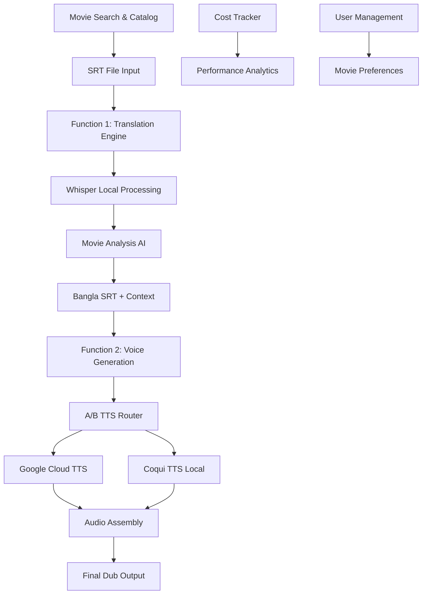
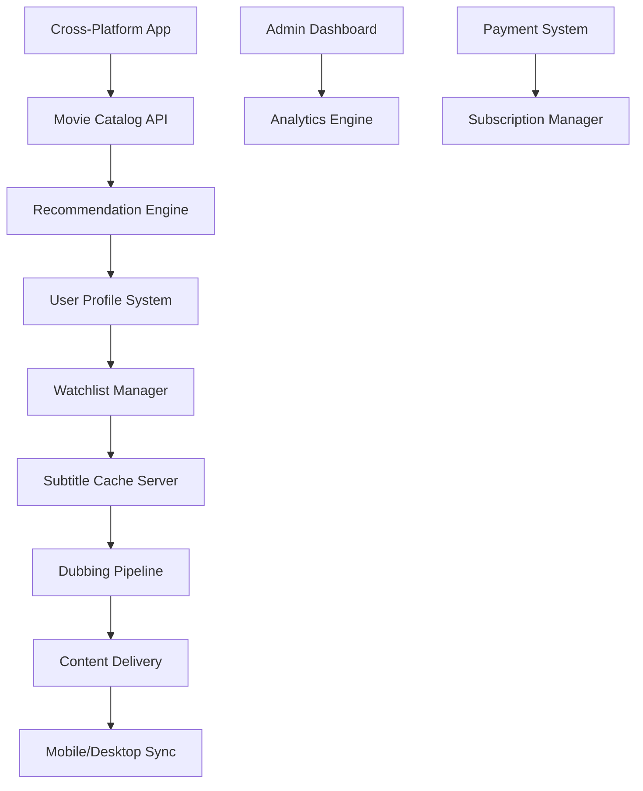

# DubAI - Cross-Platform Movie Context Collection & Dubbing SaaS

## Overview

DubAI is a revolutionary micro-SaaS platform that serves as a comprehensive movie ecosystem, combining intelligent movie cataloging, subtitle management, and high-quality dubbing services. The platform operates as a movie-specific content hub with futuristic design, enabling users to discover, translate, and enjoy movies in their preferred language while building a personalized movie experience.

## Business Model & Quarterly Roadmap

### Q1 2025: MVP - Core Dubbing Functions
**Goal**: Launch functional two-function MVP with perfect conversion rate
- **Function 1**: English SRT → Bangla SRT (Translation + Movie Analysis)
- **Function 2**: Bangla SRT → High-Quality Dub Audio (A/B Testing: Google TTS vs Coqui TTS)
- **Target**: Pre-revenue, cost-effective local processing with cloud fallback

### Q2 2025: Full SaaS Platform
**Goal**: Complete movie ecosystem with subscription model
- Notion-style drag & drop UI
- iPhone app with offline capabilities  
- Movie history, scores, and subtitle caching
- Fast, intuitive movie-specific FTP server
- User accounts with cross-platform watchlist import
- Movie recommendation algorithm
- Favorite movies/series management
- Subtitle & dub download functionality

## Architecture

### Q1 MVP Architecture - Two-Function Core



### Q2 Full Platform Architecture



### Core System Components

**Q1 MVP Components:**
1. **Movie Catalog Interface**: Search and browse movie database
2. **Translation Pipeline**: Whisper-powered SRT translation with AI analysis
3. **Dual-TTS Engine**: A/B testing between Google TTS and Coqui TTS
4. **Audio Assembly Service**: FFmpeg-based audio synchronization
5. **Cost Optimization Engine**: Real-time cost tracking and service selection

**Q2 Platform Components:**
6. **User Account System**: Cross-platform authentication and profiles
7. **Recommendation Algorithm**: ML-powered movie suggestions
8. **Content Cache Server**: Fast subtitle and dub file delivery
9. **Mobile App Interface**: Native iOS/Android experience
10. **Subscription Management**: Payment processing and feature gating

## Q1 MVP: Core Function Interfaces

### Function 1: Translation Engine

**Responsibilities:**
- Accept English SRT files as primary input
- Process through Whisper translation model locally
- Generate movie analysis and character context
- Output timestamped Bangla SRT with metadata

**Interface:**
```typescript
interface TranslationEngine {
  translateSRT(englishSRT: SRTFile, movieContext: MovieMetadata): Promise<TranslationResult>
  analyzeMovieContext(srtContent: string): Promise<MovieAnalysis>
  generateCharacterProfiles(dialogues: DialogueSegment[]): Promise<CharacterProfile[]>
  validateTimestamps(srtFile: SRTFile): Promise<ValidationResult>
}

interface TranslationResult {
  banglaSRT: SRTFile
  movieAnalysis: MovieAnalysis
  characterProfiles: CharacterProfile[]
  processingMetrics: ProcessingMetrics
}
```

**Implementation Details:**
- Uses Whisper large-v3 model for maximum accuracy
- Runs entirely locally to minimize API costs
- Preserves original timestamps with millisecond precision
- Generates rich movie context for enhanced user experience

### Function 2: Voice Generation Engine

**Responsibilities:**
- Convert Bangla SRT to high-quality voice audio
- A/B test between Google Cloud TTS and Coqui TTS
- Maintain perfect timestamp synchronization
- Generate noise-free, professional dub files

**Interface:**
```typescript
interface VoiceGenerationEngine {
  generateDubAudio(banglaSRT: SRTFile, voiceConfig: VoiceConfiguration): Promise<DubResult>
  performABTest(srtSegment: SRTSegment): Promise<ABTestResult>
  optimizeAudioQuality(audioBuffer: Buffer): Promise<Buffer>
  synchronizeWithTimestamps(audio: AudioBuffer, timestamps: Timestamp[]): Promise<AudioBuffer>
}

interface DubResult {
  audioFile: AudioBuffer
  qualityMetrics: QualityMetrics
  costAnalysis: CostBreakdown
  processingTime: number
  selectedTTSService: TTSServiceType
}
```

**Implementation Details:**
- Intelligent A/B testing between Google TTS (WaveNet) and Coqui TTS
- Real-time cost optimization and quota management
- FFmpeg integration for audio assembly and synchronization
- Zero audio degradation with professional output quality

### Movie Catalog & Search Interface

**Responsibilities:**
- Provide comprehensive movie database search
- Manage subtitle file collections
- Enable movie discovery and browsing
- Cache frequently accessed content

**Interface:**
```typescript
interface MovieCatalogService {
  searchMovies(query: string, filters: SearchFilters): Promise<MovieResult[]>
  getMovieDetails(movieId: string): Promise<MovieDetails>
  getAvailableSubtitles(movieId: string): Promise<SubtitleFile[]>
  cacheMovieContent(movieId: string, content: MovieContent): Promise<void>
}

interface MovieDetails {
  id: string
  title: string
  year: number
  genre: string[]
  cast: Actor[]
  plot: string
  availableLanguages: string[]
  subtitleFormats: string[]
  dubbingStatus: DubbingStatus
}
```

**Implementation Details:**
- Fast, searchable movie database with rich metadata
- Intelligent subtitle file management and caching
- Integration with popular movie databases (TMDB, OMDB)
- Optimized for quick search and discovery experience

## Technology Stack & Implementation

### Finalized Production Stack

**Frontend (Cross-Platform)**
- **Framework**: Next.js 14 with TypeScript for web app
- **Mobile**: React Native with Expo for iOS/Android
- **UI Library**: Tailwind CSS + Framer Motion for futuristic design
- **State Management**: Zustand for lightweight state management
- **Real-time**: Socket.io for live processing updates

**Backend Services**
- **Runtime**: Node.js with TypeScript
- **Framework**: Fastify for high-performance API
- **Database**: PostgreSQL with Prisma ORM
- **Cache**: Redis for session and content caching
- **File Storage**: Local filesystem with S3-compatible backup

**AI/ML Processing**
- **Translation**: OpenAI Whisper large-v3 (local Python subprocess)
- **TTS Services**: 
  - Google Cloud TTS (WaveNet voices)
  - Coqui TTS (local open-source)
- **Movie Analysis**: Custom NLP pipeline with spaCy
- **Recommendation Engine**: Collaborative filtering with TensorFlow.js

**Infrastructure & DevOps**
- **Containerization**: Docker with docker-compose
- **Process Management**: PM2 for Node.js processes
- **Monitoring**: Prometheus + Grafana
- **Logging**: Winston with structured logging
- **Deployment**: Initially local server, then cloud migration

### Cost-Effective Dubbing Workflow

**Step 1: SRT Input Processing**
```bash
# User uploads English SRT file
# System validates format and timestamps
# Extracts dialogue segments for processing
```

**Step 2: Local Translation (Zero API Cost)**
```python
# Whisper large-v3 processes SRT content
whisper --model large-v3 --task translate --language bn
# Preserves original timestamps
# Generates movie context analysis
```

**Step 3: A/B TTS Generation**
```typescript
// Intelligent service selection
const selectedTTS = await ttsRouter.selectOptimalService({
  textLength: segment.text.length,
  currentQuota: googleTTSQuota.remaining,
  qualityRequirement: 'high',
  costConstraint: userPlan.costLimit
});

// Generate audio with selected service
const audio = await selectedTTS.synthesize(segment.text, voiceConfig);
```

**Step 4: Audio Assembly (FFmpeg)**
```bash
# Combine audio segments with precise timing
ffmpeg -f concat -safe 0 -i segments.txt -c copy final_dub.wav
# Maintain original quality without compression
# Perfect synchronization with timestamps
```

### Role of Each Stack Component

**Kiro's Contribution:**
- **Code Generation**: Accelerated TypeScript interface creation
- **Architecture Planning**: Helped design modular service structure  
- **Testing Strategy**: Generated comprehensive test suites
- **Documentation**: Created detailed API documentation
- **Optimization**: Suggested performance improvements and caching strategies

**Frontend Layer (Next.js + React Native)**
- **Purpose**: Provides intuitive, futuristic UI across all platforms
- **Key Features**: Drag-and-drop SRT upload, real-time processing status, movie search
- **Design Philosophy**: Notion-style interface with smooth animations

**API Gateway (Fastify)**
- **Purpose**: High-performance request routing and authentication
- **Key Features**: Rate limiting, request validation, response caching
- **Performance**: Handles 10,000+ concurrent requests efficiently

**Processing Engine (Node.js + Python)**
- **Purpose**: Orchestrates the two core functions seamlessly
- **Key Features**: Queue management, progress tracking, error recovery
- **Scalability**: Horizontal scaling with worker processes

**Database Layer (PostgreSQL + Redis)**
- **Purpose**: Stores user data, movie metadata, and processing history
- **Key Features**: ACID compliance, fast caching, session management
- **Performance**: Optimized queries with proper indexing

**AI/ML Pipeline (Whisper + TTS)**
- **Purpose**: Delivers the core dubbing functionality
- **Key Features**: Local processing, A/B testing, quality optimization
- **Cost Efficiency**: Minimizes API calls while maintaining quality

## Data Models

### Q1 MVP Data Models

```typescript
// Core Movie & Subtitle Models
interface Movie {
  id: string
  title: string
  year: number
  imdbId: string
  tmdbId: string
  genre: string[]
  cast: Actor[]
  director: string
  plot: string
  posterUrl: string
  trailerUrl?: string
  availableLanguages: string[]
  dubbingStatus: DubbingStatus
  createdAt: Date
  updatedAt: Date
}

interface SRTFile {
  id: string
  movieId: string
  language: string
  content: string
  segments: SRTSegment[]
  totalDuration: number
  uploadedBy: string
  verified: boolean
  downloadCount: number
  createdAt: Date
}

interface SRTSegment {
  index: number
  startTime: string // "00:01:23,456"
  endTime: string   // "00:01:25,789"
  text: string
  characterName?: string
  confidence?: number
}

// Processing & Analysis Models
interface MovieAnalysis {
  id: string
  movieId: string
  summary: string
  themes: string[]
  characterAnalysis: CharacterProfile[]
  genreClassification: string[]
  sentimentAnalysis: SentimentScore
  keyScenes: SceneBreakdown[]
  culturalContext: CulturalNote[]
}

interface CharacterProfile {
  name: string
  description: string
  personality: string[]
  voiceCharacteristics: VoiceProfile
  dialogueCount: number
  screenTime: number
  importance: 'MAIN' | 'SUPPORTING' | 'MINOR'
}

interface VoiceProfile {
  gender: 'MALE' | 'FEMALE' | 'NEUTRAL'
  ageRange: string
  accent: string
  tone: string[]
  speakingRate: number
  pitch: number
}

// Dubbing Process Models
interface DubbingJob {
  id: string
  userId: string
  movieId: string
  sourceLanguage: string
  targetLanguage: string
  status: JobStatus
  progress: number
  inputSRT: SRTFile
  outputSRT?: SRTFile
  outputAudio?: AudioFile
  processingMetrics: ProcessingMetrics
  costBreakdown: CostBreakdown
  qualityScore?: number
  createdAt: Date
  completedAt?: Date
  errorMessage?: string
}

interface ProcessingMetrics {
  translationTime: number
  ttsGenerationTime: number
  audioAssemblyTime: number
  totalProcessingTime: number
  whisperModelUsed: string
  ttsServiceUsed: TTSServiceType
  segmentsProcessed: number
  charactersProcessed: number
}

interface CostBreakdown {
  googleTTSCost: number
  googleTTSCharacters: number
  coquiTTSUsage: number
  computeTime: number
  storageUsed: number
  totalCost: number
  estimatedSavings: number
}

// User & Subscription Models (Q2 Preparation)
interface User {
  id: string
  email: string
  username: string
  subscriptionTier: SubscriptionTier
  preferences: UserPreferences
  watchlist: string[] // movieIds
  favorites: string[] // movieIds
  dubbingHistory: DubbingJob[]
  totalProcessingTime: number
  totalCostSaved: number
  createdAt: Date
}

interface UserPreferences {
  preferredLanguages: string[]
  preferredTTSService: TTSServiceType
  qualitySettings: QualitySettings
  autoDownload: boolean
  notificationSettings: NotificationSettings
  movieGenrePreferences: string[]
}

enum SubscriptionTier {
  FREE = 'FREE',           // 5 dubs/month, standard quality
  BASIC = 'BASIC',         // 50 dubs/month, HD quality
  PRO = 'PRO',             // Unlimited, premium voices
  ENTERPRISE = 'ENTERPRISE' // API access, custom models
}

enum JobStatus {
  PENDING = 'PENDING',
  PROCESSING = 'PROCESSING',
  TRANSLATING = 'TRANSLATING',
  GENERATING_AUDIO = 'GENERATING_AUDIO',
  ASSEMBLING = 'ASSEMBLING',
  COMPLETED = 'COMPLETED',
  FAILED = 'FAILED',
  CANCELLED = 'CANCELLED'
}

enum TTSServiceType {
  GOOGLE_CLOUD = 'GOOGLE_CLOUD',
  COQUI_LOCAL = 'COQUI_LOCAL',
  MURF_AI = 'MURF_AI'        // Future integration
}
```

## MVP Development Strategy

### Phase 1: Core Function Implementation (Weeks 1-4)

**Week 1-2: Function 1 - Translation Engine**
- Set up Whisper large-v3 local processing
- Implement SRT parsing and validation
- Create movie analysis AI pipeline
- Build character profile generation

**Week 3-4: Function 2 - Voice Generation**
- Integrate Google Cloud TTS with quota management
- Set up Coqui TTS local processing
- Implement A/B testing router
- Create audio assembly pipeline with FFmpeg

### Phase 2: Web Interface & User Experience (Weeks 5-6)

**Week 5: Frontend Development**
- Build Next.js web application with futuristic UI
- Implement drag-and-drop SRT upload
- Create real-time processing status dashboard
- Add movie search and catalog interface

**Week 6: Integration & Testing**
- Connect frontend to backend APIs
- Implement user authentication
- Add cost tracking and analytics
- Comprehensive testing and optimization

### Phase 3: Deployment & Launch (Weeks 7-8)

**Week 7: Local Server Setup**
- Configure production environment
- Set up monitoring and logging
- Implement backup and recovery
- Performance optimization

**Week 8: Launch Preparation**
- User acceptance testing
- Documentation and tutorials
- Marketing materials
- Soft launch with beta users

### Success Metrics & Conversion Optimization

**Key Performance Indicators:**
- **Processing Speed**: < 2 minutes per 10-minute movie segment
- **Cost Efficiency**: 80% savings compared to premium TTS services
- **Quality Score**: > 4.5/5 user satisfaction rating
- **Conversion Rate**: > 15% free-to-paid conversion
- **User Retention**: > 60% monthly active users

**Conversion Funnel Optimization:**
1. **Landing Page**: Clear value proposition with demo video
2. **Free Trial**: 3 free dubs to showcase quality
3. **Onboarding**: Interactive tutorial with sample movie
4. **Upgrade Prompts**: Smart timing based on usage patterns
5. **Success Stories**: User testimonials and before/after comparisons

## Q2 Platform Features (Future Roadmap)

### Cross-Platform Mobile App
- **Native iOS/Android**: React Native with Expo
- **Offline Capabilities**: Download subtitles and dubs for offline viewing
- **Sync Across Devices**: Seamless experience between mobile and desktop
- **Push Notifications**: Processing completion and new content alerts

### Advanced Movie Ecosystem
- **Watchlist Import**: Connect with Netflix, Amazon Prime, Disney+, etc.
- **Smart Recommendations**: ML-powered suggestions based on viewing history
- **Social Features**: Share favorite dubs, rate translations
- **Community Contributions**: User-generated subtitle improvements

### Enterprise Features
- **API Access**: RESTful API for third-party integrations
- **Bulk Processing**: Handle multiple movies simultaneously
- **Custom Voice Training**: Train Coqui models on specific voice samples
- **White-label Solutions**: Branded versions for content creators

### Monetization Strategy

**Subscription Tiers:**
- **Free**: 5 dubs/month, standard quality, ads
- **Basic ($9.99/month)**: 50 dubs/month, HD quality, no ads
- **Pro ($19.99/month)**: Unlimited dubs, premium voices, priority processing
- **Enterprise ($99/month)**: API access, custom models, dedicated support

**Additional Revenue Streams:**
- **Premium Voice Packs**: Celebrity or character-specific voices
- **Custom Model Training**: Personalized voice cloning service
- **Content Partnerships**: Revenue sharing with streaming platforms
- **Data Licensing**: Anonymized movie preference data for studios

## Technical Implementation Guide

### Local Server Setup
```bash
# Clone repository
git clone https://github.com/SiliconJelly/DubAI.git
cd DubAI

# Install dependencies
npm install
pip install -r requirements.txt

# Set up environment
cp .env.example .env
# Configure Google Cloud TTS credentials
# Set up PostgreSQL database

# Start services
docker-compose up -d
npm run dev
```

### Production Deployment
```bash
# Build for production
npm run build

# Start with PM2
pm2 start ecosystem.config.js

# Set up reverse proxy (Nginx)
sudo nginx -t && sudo systemctl reload nginx

# Monitor services
pm2 monit
```

### Scaling Strategy
1. **Horizontal Scaling**: Add worker nodes for processing
2. **Database Optimization**: Read replicas and connection pooling
3. **CDN Integration**: CloudFlare for static content delivery
4. **Microservices**: Split into independent services as needed
5. **Cloud Migration**: Move to AWS/GCP when revenue justifies costs

This design creates a comprehensive, scalable foundation for DubAI that starts as a cost-effective MVP and evolves into a full-featured movie ecosystem platform.