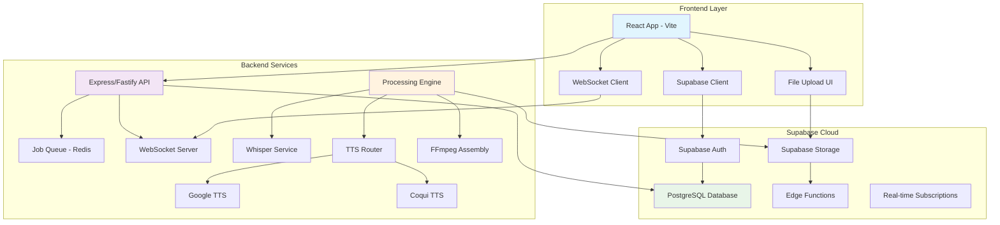

# DubAI Full-Stack MVP Integration Design

## Overview

This design document outlines the architecture for integrating the existing DubAI backend services (Node.js/TypeScript with Whisper, Google TTS, and Coqui TTS) with the Kombai-generated React frontend, creating a unified full-stack application deployable on Supabase. The design focuses on seamless user experience, real-time processing updates, and scalable cloud deployment while maintaining the cost-effective local processing capabilities.

## Architecture

### High-Level System Architecture



### Integration Strategy

The design follows a hybrid approach where:
- **Frontend**: React app served from Supabase hosting
- **Authentication & Database**: Fully managed by Supabase
- **File Storage**: Supabase Storage for uploads and outputs
- **Processing Engine**: Node.js backend running on Supabase Edge Functions or external server
- **Real-time Updates**: Supabase Real-time for job status updates

## Components and Interfaces

### Frontend Architecture

#### Core React Components Structure
```
src/
├── components/
│   ├── upload/
│   │   ├── FileUploader.tsx          # Drag-and-drop upload
│   │   ├── ProgressIndicator.tsx     # Upload progress
│   │   └── FileValidator.tsx         # Client-side validation
│   ├── dashboard/
│   │   ├── JobDashboard.tsx          # Main processing dashboard
│   │   ├── JobCard.tsx               # Individual job status
│   │   ├── ProgressBar.tsx           # Real-time progress
│   │   └── JobHistory.tsx            # Historical jobs
│   ├── processing/
│   │   ├── ProcessingSteps.tsx       # Step-by-step progress
│   │   ├── ServiceSelector.tsx       # TTS service selection
│   │   └── QualityMetrics.tsx        # Processing quality display
│   └── shared/
│       ├── Layout.tsx                # Main app layout
│       ├── Navigation.tsx            # Navigation component
│       └── ErrorBoundary.tsx         # Error handling
├── hooks/
│   ├── useSupabase.ts                # Supabase client hook
│   ├── useJobStatus.ts               # Real-time job updates
│   ├── useFileUpload.ts              # File upload management
│   └── useWebSocket.ts               # WebSocket connection
├── services/
│   ├── api.ts                        # API client
│   ├── supabase.ts                   # Supabase configuration
│   ├── websocket.ts                  # WebSocket client
│   └── fileService.ts                # File handling utilities
└── types/
    ├── job.ts                        # Job-related types
    ├── user.ts                       # User types
    └── api.ts                        # API response types
```

#### Key Frontend Interfaces

```typescript
// Job Management Types
interface DubbingJob {
  id: string;
  userId: string;
  title: string;
  status: JobStatus;
  progress: number;
  createdAt: string;
  updatedAt: string;
  inputFiles: {
    video?: FileReference;
    srt?: FileReference;
  };
  outputFiles: {
    dubbedAudio?: FileReference;
    translatedSrt?: FileReference;
  };
  processingMetrics: ProcessingMetrics;
  errorMessage?: string;
}

enum JobStatus {
  UPLOADED = 'uploaded',
  EXTRACTING_AUDIO = 'extracting_audio',
  TRANSCRIBING = 'transcribing',
  TRANSLATING = 'translating',
  GENERATING_SPEECH = 'generating_speech',
  ASSEMBLING_AUDIO = 'assembling_audio',
  COMPLETED = 'completed',
  FAILED = 'failed'
}

interface ProcessingMetrics {
  audioExtractionTime?: number;
  transcriptionTime?: number;
  translationTime?: number;
  ttsGenerationTime?: number;
  audioAssemblyTime?: number;
  totalProcessingTime?: number;
  ttsService?: 'google' | 'coqui';
  costBreakdown: CostBreakdown;
}

// File Management Types
interface FileReference {
  id: string;
  filename: string;
  size: number;
  mimeType: string;
  storagePath: string;
  downloadUrl?: string;
  uploadedAt: string;
}

// Real-time Updates
interface JobUpdate {
  jobId: string;
  status: JobStatus;
  progress: number;
  message?: string;
  metrics?: Partial<ProcessingMetrics>;
  error?: string;
}
```

### Backend Architecture

#### API Layer Design

```typescript
// Main API Routes
interface APIRoutes {
  // Authentication (delegated to Supabase)
  'POST /auth/callback': (req: AuthCallbackRequest) => Promise<AuthResponse>;
  
  // Job Management
  'POST /jobs': (req: CreateJobRequest) => Promise<JobResponse>;
  'GET /jobs': (req: ListJobsRequest) => Promise<JobListResponse>;
  'GET /jobs/:id': (req: GetJobRequest) => Promise<JobResponse>;
  'DELETE /jobs/:id': (req: DeleteJobRequest) => Promise<void>;
  
  // File Operations
  'POST /files/upload': (req: FileUploadRequest) => Promise<FileUploadResponse>;
  'GET /files/:id/download': (req: FileDownloadRequest) => Promise<FileDownloadResponse>;
  
  // Processing Control
  'POST /jobs/:id/start': (req: StartProcessingRequest) => Promise<void>;
  'POST /jobs/:id/cancel': (req: CancelJobRequest) => Promise<void>;
  
  // Monitoring
  'GET /health': () => Promise<HealthResponse>;
  'GET /metrics': (req: MetricsRequest) => Promise<MetricsResponse>;
}

// Processing Pipeline Interface
interface ProcessingPipeline {
  executeJob(jobId: string): Promise<void>;
  extractAudio(videoFile: FileReference): Promise<FileReference>;
  transcribeAndTranslate(audioFile: FileReference): Promise<TranscriptionResult>;
  generateSpeech(translation: TranscriptionResult): Promise<AudioSegment[]>;
  assembleAudio(segments: AudioSegment[]): Promise<FileReference>;
  updateJobStatus(jobId: string, status: JobStatus, progress: number): Promise<void>;
}
```

#### Integration with Existing Services

The design leverages existing backend services:

```typescript
// Service Integration Layer
class ServiceIntegrator {
  constructor(
    private transcriptionService: TranscriptionServiceImpl,
    private ttsRouter: TTSRouterImpl,
    private audioAssembly: AudioAssemblyServiceImpl,
    private videoAssembly: VideoAssemblyServiceImpl,
    private supabaseClient: SupabaseClient
  ) {}

  async processJob(job: DubbingJob): Promise<void> {
    try {
      // Update status: Extracting Audio
      await this.updateJobStatus(job.id, JobStatus.EXTRACTING_AUDIO, 10);
      const audioFile = await this.extractAudioFromVideo(job.inputFiles.video);

      // Update status: Transcribing
      await this.updateJobStatus(job.id, JobStatus.TRANSCRIBING, 25);
      const transcription = await this.transcriptionService.transcribeAudio(audioFile);

      // Update status: Translating
      await this.updateJobStatus(job.id, JobStatus.TRANSLATING, 40);
      const translation = await this.transcriptionService.translateToTarget(transcription, 'bn');

      // Update status: Generating Speech
      await this.updateJobStatus(job.id, JobStatus.GENERATING_SPEECH, 60);
      const audioSegments = await this.generateSpeechSegments(translation);

      // Update status: Assembling Audio
      await this.updateJobStatus(job.id, JobStatus.ASSEMBLING_AUDIO, 80);
      const finalAudio = await this.audioAssembly.assembleAudioTrack(audioSegments);

      // Update status: Completed
      await this.updateJobStatus(job.id, JobStatus.COMPLETED, 100);
      await this.saveOutputFiles(job.id, finalAudio);

    } catch (error) {
      await this.updateJobStatus(job.id, JobStatus.FAILED, 0, error.message);
      throw error;
    }
  }
}
```

### Supabase Integration

#### Database Schema

```sql
-- Users table (managed by Supabase Auth)
-- Additional user profile data
CREATE TABLE user_profiles (
  id UUID REFERENCES auth.users(id) PRIMARY KEY,
  username TEXT UNIQUE,
  full_name TEXT,
  avatar_url TEXT,
  subscription_tier TEXT DEFAULT 'free',
  total_processing_time INTEGER DEFAULT 0,
  total_jobs_completed INTEGER DEFAULT 0,
  created_at TIMESTAMP WITH TIME ZONE DEFAULT NOW(),
  updated_at TIMESTAMP WITH TIME ZONE DEFAULT NOW()
);

-- Jobs table
CREATE TABLE dubbing_jobs (
  id UUID DEFAULT gen_random_uuid() PRIMARY KEY,
  user_id UUID REFERENCES auth.users(id) NOT NULL,
  title TEXT NOT NULL,
  status TEXT NOT NULL DEFAULT 'uploaded',
  progress INTEGER DEFAULT 0,
  input_video_file_id UUID REFERENCES storage_files(id),
  input_srt_file_id UUID REFERENCES storage_files(id),
  output_audio_file_id UUID REFERENCES storage_files(id),
  output_srt_file_id UUID REFERENCES storage_files(id),
  processing_metrics JSONB,
  error_message TEXT,
  created_at TIMESTAMP WITH TIME ZONE DEFAULT NOW(),
  updated_at TIMESTAMP WITH TIME ZONE DEFAULT NOW()
);

-- File references table
CREATE TABLE storage_files (
  id UUID DEFAULT gen_random_uuid() PRIMARY KEY,
  user_id UUID REFERENCES auth.users(id) NOT NULL,
  filename TEXT NOT NULL,
  file_size BIGINT NOT NULL,
  mime_type TEXT NOT NULL,
  storage_path TEXT NOT NULL,
  file_type TEXT NOT NULL, -- 'video', 'audio', 'srt'
  created_at TIMESTAMP WITH TIME ZONE DEFAULT NOW()
);

-- Processing metrics table
CREATE TABLE processing_metrics (
  id UUID DEFAULT gen_random_uuid() PRIMARY KEY,
  job_id UUID REFERENCES dubbing_jobs(id) NOT NULL,
  step_name TEXT NOT NULL,
  start_time TIMESTAMP WITH TIME ZONE,
  end_time TIMESTAMP WITH TIME ZONE,
  duration_ms INTEGER,
  service_used TEXT,
  cost_estimate DECIMAL(10,4),
  metadata JSONB,
  created_at TIMESTAMP WITH TIME ZONE DEFAULT NOW()
);

-- Row Level Security Policies
ALTER TABLE user_profiles ENABLE ROW LEVEL SECURITY;
ALTER TABLE dubbing_jobs ENABLE ROW LEVEL SECURITY;
ALTER TABLE storage_files ENABLE ROW LEVEL SECURITY;
ALTER TABLE processing_metrics ENABLE ROW LEVEL SECURITY;

-- Policies
CREATE POLICY "Users can view own profile" ON user_profiles
  FOR SELECT USING (auth.uid() = id);

CREATE POLICY "Users can update own profile" ON user_profiles
  FOR UPDATE USING (auth.uid() = id);

CREATE POLICY "Users can view own jobs" ON dubbing_jobs
  FOR SELECT USING (auth.uid() = user_id);

CREATE POLICY "Users can create own jobs" ON dubbing_jobs
  FOR INSERT WITH CHECK (auth.uid() = user_id);

CREATE POLICY "Users can update own jobs" ON dubbing_jobs
  FOR UPDATE USING (auth.uid() = user_id);
```

#### Storage Organization

```
supabase-storage/
├── uploads/
│   ├── {user_id}/
│   │   ├── videos/
│   │   │   └── {job_id}/
│   │   │       └── original.mp4
│   │   └── srt/
│   │       └── {job_id}/
│   │           └── original.srt
├── processing/
│   └── {user_id}/
│       └── {job_id}/
│           ├── extracted_audio.wav
│           ├── transcription.json
│           └── translation.json
└── outputs/
    └── {user_id}/
        └── {job_id}/
            ├── dubbed_audio.wav
            ├── translated.srt
            └── final_video.mp4
```

## Data Models

### Core Data Models

```typescript
// User Management
interface UserProfile {
  id: string;
  username: string;
  fullName: string;
  avatarUrl?: string;
  subscriptionTier: 'free' | 'basic' | 'pro' | 'enterprise';
  totalProcessingTime: number;
  totalJobsCompleted: number;
  createdAt: string;
  updatedAt: string;
}

// Job Management
interface DubbingJob {
  id: string;
  userId: string;
  title: string;
  status: JobStatus;
  progress: number;
  inputFiles: {
    video?: StorageFile;
    srt?: StorageFile;
  };
  outputFiles: {
    dubbedAudio?: StorageFile;
    translatedSrt?: StorageFile;
    finalVideo?: StorageFile;
  };
  processingMetrics: ProcessingMetrics;
  errorMessage?: string;
  createdAt: string;
  updatedAt: string;
}

// File Management
interface StorageFile {
  id: string;
  userId: string;
  filename: string;
  fileSize: number;
  mimeType: string;
  storagePath: string;
  fileType: 'video' | 'audio' | 'srt' | 'image';
  downloadUrl?: string;
  createdAt: string;
}

// Processing Metrics
interface ProcessingMetrics {
  steps: ProcessingStep[];
  totalDuration: number;
  totalCost: number;
  ttsService: 'google' | 'coqui';
  qualityScore?: number;
}

interface ProcessingStep {
  name: string;
  startTime: string;
  endTime?: string;
  duration?: number;
  serviceUsed?: string;
  costEstimate: number;
  metadata?: Record<string, any>;
}

// Real-time Communication
interface WebSocketMessage {
  type: 'job_update' | 'error' | 'system_message';
  payload: JobUpdate | ErrorMessage | SystemMessage;
  timestamp: string;
}

interface JobUpdate {
  jobId: string;
  status: JobStatus;
  progress: number;
  currentStep?: string;
  estimatedTimeRemaining?: number;
  metrics?: Partial<ProcessingMetrics>;
}
```

## Error Handling

### Frontend Error Handling Strategy

```typescript
// Error Boundary Component
class ProcessingErrorBoundary extends React.Component {
  constructor(props) {
    super(props);
    this.state = { hasError: false, error: null };
  }

  static getDerivedStateFromError(error) {
    return { hasError: true, error };
  }

  componentDidCatch(error, errorInfo) {
    // Log error to monitoring service
    console.error('Processing error:', error, errorInfo);
    // Send to error tracking service
  }

  render() {
    if (this.state.hasError) {
      return <ErrorFallback error={this.state.error} />;
    }
    return this.props.children;
  }
}

// API Error Handling
class APIClient {
  async request<T>(endpoint: string, options: RequestOptions): Promise<T> {
    try {
      const response = await fetch(endpoint, options);
      
      if (!response.ok) {
        const errorData = await response.json();
        throw new APIError(errorData.message, response.status, errorData.code);
      }
      
      return await response.json();
    } catch (error) {
      if (error instanceof APIError) {
        throw error;
      }
      throw new NetworkError('Network request failed', error);
    }
  }
}

// Custom Error Types
class APIError extends Error {
  constructor(
    message: string,
    public statusCode: number,
    public errorCode?: string
  ) {
    super(message);
    this.name = 'APIError';
  }
}

class ProcessingError extends Error {
  constructor(
    message: string,
    public step: string,
    public jobId: string
  ) {
    super(message);
    this.name = 'ProcessingError';
  }
}
```

### Backend Error Handling

```typescript
// Global Error Handler
class ErrorHandler {
  static handle(error: Error, jobId?: string): void {
    console.error('Error occurred:', error);
    
    if (jobId) {
      // Update job status to failed
      this.updateJobStatus(jobId, JobStatus.FAILED, 0, error.message);
    }
    
    // Send to monitoring service
    this.sendToMonitoring(error, { jobId });
  }

  static async updateJobStatus(
    jobId: string, 
    status: JobStatus, 
    progress: number, 
    errorMessage?: string
  ): Promise<void> {
    try {
      await supabase
        .from('dubbing_jobs')
        .update({ 
          status, 
          progress, 
          error_message: errorMessage,
          updated_at: new Date().toISOString()
        })
        .eq('id', jobId);
    } catch (updateError) {
      console.error('Failed to update job status:', updateError);
    }
  }
}

// Retry Logic for Processing Steps
class RetryableProcessor {
  async executeWithRetry<T>(
    operation: () => Promise<T>,
    maxRetries: number = 3,
    delay: number = 1000
  ): Promise<T> {
    let lastError: Error;
    
    for (let attempt = 1; attempt <= maxRetries; attempt++) {
      try {
        return await operation();
      } catch (error) {
        lastError = error;
        
        if (attempt === maxRetries) {
          throw error;
        }
        
        // Exponential backoff
        await new Promise(resolve => setTimeout(resolve, delay * Math.pow(2, attempt - 1)));
      }
    }
    
    throw lastError!;
  }
}
```

## Testing Strategy

### Frontend Testing

```typescript
// Component Testing with React Testing Library
describe('FileUploader Component', () => {
  test('should handle file upload successfully', async () => {
    const mockOnUpload = jest.fn();
    render(<FileUploader onUpload={mockOnUpload} />);
    
    const file = new File(['test content'], 'test.mp4', { type: 'video/mp4' });
    const input = screen.getByLabelText(/upload video/i);
    
    await userEvent.upload(input, file);
    
    expect(mockOnUpload).toHaveBeenCalledWith(file);
  });

  test('should show error for invalid file type', async () => {
    render(<FileUploader onUpload={jest.fn()} />);
    
    const file = new File(['test'], 'test.txt', { type: 'text/plain' });
    const input = screen.getByLabelText(/upload video/i);
    
    await userEvent.upload(input, file);
    
    expect(screen.getByText(/invalid file type/i)).toBeInTheDocument();
  });
});

// Integration Testing with MSW
const server = setupServer(
  rest.post('/api/jobs', (req, res, ctx) => {
    return res(ctx.json({ id: 'job-123', status: 'uploaded' }));
  }),
  rest.get('/api/jobs/:id', (req, res, ctx) => {
    return res(ctx.json({ 
      id: req.params.id, 
      status: 'processing', 
      progress: 50 
    }));
  })
);

describe('Job Processing Flow', () => {
  beforeAll(() => server.listen());
  afterEach(() => server.resetHandlers());
  afterAll(() => server.close());

  test('should create job and show progress', async () => {
    render(<App />);
    
    // Upload file
    const file = new File(['video'], 'test.mp4', { type: 'video/mp4' });
    await userEvent.upload(screen.getByLabelText(/upload/i), file);
    
    // Start processing
    await userEvent.click(screen.getByText(/start processing/i));
    
    // Check job creation
    await waitFor(() => {
      expect(screen.getByText(/processing/i)).toBeInTheDocument();
    });
  });
});
```

### Backend Testing

```typescript
// Unit Testing for Services
describe('ProcessingPipeline', () => {
  let pipeline: ProcessingPipeline;
  let mockTranscriptionService: jest.Mocked<TranscriptionService>;
  let mockTTSRouter: jest.Mocked<TTSRouter>;

  beforeEach(() => {
    mockTranscriptionService = createMockTranscriptionService();
    mockTTSRouter = createMockTTSRouter();
    pipeline = new ProcessingPipeline(mockTranscriptionService, mockTTSRouter);
  });

  test('should process job successfully', async () => {
    const job = createMockJob();
    mockTranscriptionService.transcribeAudio.mockResolvedValue(mockTranscription);
    mockTTSRouter.generateSpeech.mockResolvedValue(mockAudioSegment);

    await pipeline.executeJob(job.id);

    expect(mockTranscriptionService.transcribeAudio).toHaveBeenCalled();
    expect(mockTTSRouter.generateSpeech).toHaveBeenCalled();
  });

  test('should handle transcription failure', async () => {
    const job = createMockJob();
    mockTranscriptionService.transcribeAudio.mockRejectedValue(new Error('Transcription failed'));

    await expect(pipeline.executeJob(job.id)).rejects.toThrow('Transcription failed');
  });
});

// Integration Testing with Test Database
describe('API Endpoints', () => {
  let app: Express;
  let testDb: SupabaseClient;

  beforeAll(async () => {
    testDb = createTestSupabaseClient();
    app = createTestApp(testDb);
  });

  afterEach(async () => {
    await cleanupTestData(testDb);
  });

  test('POST /jobs should create new job', async () => {
    const response = await request(app)
      .post('/api/jobs')
      .send({ title: 'Test Job', videoFile: 'test.mp4' })
      .expect(201);

    expect(response.body).toMatchObject({
      id: expect.any(String),
      status: 'uploaded',
      title: 'Test Job'
    });
  });
});
```

## Deployment Architecture

### Supabase Deployment Strategy

```typescript
// Edge Function for Processing
export const corsHeaders = {
  'Access-Control-Allow-Origin': '*',
  'Access-Control-Allow-Headers': 'authorization, x-client-info, apikey, content-type',
}

serve(async (req) => {
  if (req.method === 'OPTIONS') {
    return new Response('ok', { headers: corsHeaders })
  }

  try {
    const { jobId } = await req.json()
    
    // Initialize Supabase client
    const supabase = createClient(
      Deno.env.get('SUPABASE_URL') ?? '',
      Deno.env.get('SUPABASE_ANON_KEY') ?? '',
      { auth: { persistSession: false } }
    )

    // Get job details
    const { data: job } = await supabase
      .from('dubbing_jobs')
      .select('*')
      .eq('id', jobId)
      .single()

    if (!job) {
      throw new Error('Job not found')
    }

    // Process job (this would call your existing services)
    await processJob(job, supabase)

    return new Response(
      JSON.stringify({ success: true }),
      { headers: { ...corsHeaders, 'Content-Type': 'application/json' } }
    )
  } catch (error) {
    return new Response(
      JSON.stringify({ error: error.message }),
      { 
        status: 400,
        headers: { ...corsHeaders, 'Content-Type': 'application/json' }
      }
    )
  }
})
```

### Environment Configuration

```typescript
// Environment Variables
interface EnvironmentConfig {
  // Supabase Configuration
  SUPABASE_URL: string;
  SUPABASE_ANON_KEY: string;
  SUPABASE_SERVICE_ROLE_KEY: string;
  
  // External Services
  GOOGLE_CLOUD_PROJECT_ID: string;
  GOOGLE_APPLICATION_CREDENTIALS: string;
  
  // Processing Configuration
  WHISPER_MODEL_PATH: string;
  COQUI_MODEL_PATH: string;
  TEMP_DIRECTORY: string;
  MAX_FILE_SIZE: string;
  
  // Monitoring
  SENTRY_DSN?: string;
  LOG_LEVEL: string;
}

// Configuration Loader
class ConfigLoader {
  static load(): EnvironmentConfig {
    const config = {
      SUPABASE_URL: process.env.SUPABASE_URL || '',
      SUPABASE_ANON_KEY: process.env.SUPABASE_ANON_KEY || '',
      SUPABASE_SERVICE_ROLE_KEY: process.env.SUPABASE_SERVICE_ROLE_KEY || '',
      GOOGLE_CLOUD_PROJECT_ID: process.env.GOOGLE_CLOUD_PROJECT_ID || '',
      GOOGLE_APPLICATION_CREDENTIALS: process.env.GOOGLE_APPLICATION_CREDENTIALS || '',
      WHISPER_MODEL_PATH: process.env.WHISPER_MODEL_PATH || './models/whisper',
      COQUI_MODEL_PATH: process.env.COQUI_MODEL_PATH || './models/coqui',
      TEMP_DIRECTORY: process.env.TEMP_DIRECTORY || './temp',
      MAX_FILE_SIZE: process.env.MAX_FILE_SIZE || '500MB',
      SENTRY_DSN: process.env.SENTRY_DSN,
      LOG_LEVEL: process.env.LOG_LEVEL || 'info'
    };

    this.validateConfig(config);
    return config;
  }

  private static validateConfig(config: EnvironmentConfig): void {
    const required = ['SUPABASE_URL', 'SUPABASE_ANON_KEY'];
    const missing = required.filter(key => !config[key as keyof EnvironmentConfig]);
    
    if (missing.length > 0) {
      throw new Error(`Missing required environment variables: ${missing.join(', ')}`);
    }
  }
}
```

This design provides a comprehensive architecture for integrating the existing DubAI backend with the React frontend and deploying it on Supabase, ensuring scalability, reliability, and a great user experience.